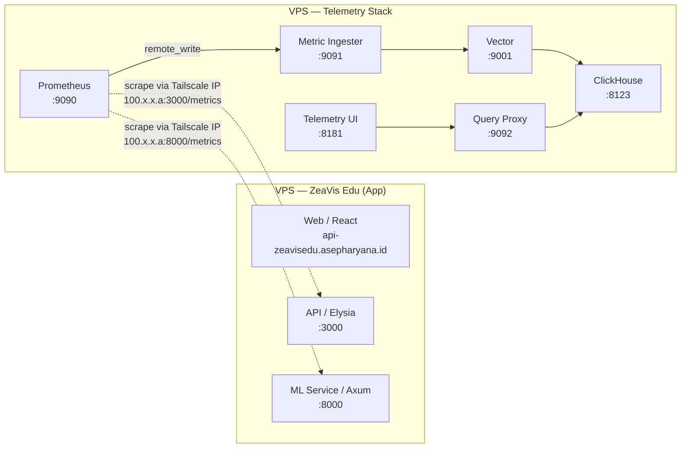

# ZeaVis Edu

ZeaVis Edu adalah aplikasi edukasi untuk membantu mengenali penyakit daun jagung melalui klasifikasi gambar berbasis machine learning. Repositori ini menggabungkan aplikasi web, API backend, layanan inferensi ML, serta pipeline pelatihan dan ekspor model EfficientNetV2B0.

## Fitur Utama

- Aplikasi web untuk pengalaman pengguna dan interaksi edukatif.
- API backend untuk status layanan, integrasi data, dan komunikasi dengan layanan ML.
- ML service berbasis Rust/Axum dengan ONNX Runtime untuk inferensi penyakit daun jagung dari gambar.
- Pipeline machine learning untuk preprocessing dataset, training di Google Colab, dan ekspor model produksi.
- Dukungan Docker untuk deployment web, API, dan ML service.
- Workspace monorepo berbasis Bun dan Moon untuk menjalankan task development, typecheck, dan build secara terpusat.

## Kelas Penyakit

Model klasifikasi menargetkan empat label berbahasa Indonesia:

| Label | Deskripsi |
|---|---|
| Bercak Daun | Gray Leaf Spot |
| Hawar Daun | Northern/Southern Leaf Blight |
| Karat Daun | Common Rust |
| Daun Sehat | Daun jagung tanpa gejala penyakit |

## Struktur Proyek

```text
.
├── apps/
│   ├── api/              # Backend Elysia/Bun
│   ├── ml-service/       # Layanan inferensi Rust/Axum + ONNX Runtime
│   └── web/              # Frontend React + Vite
├── Machine_Learning/     # Pipeline dataset, training, dan ekspor model
├── packages/
│   └── shared/           # Tipe dan utilitas bersama TypeScript
├── docker-compose.yml    # Konfigurasi deployment container
├── package.json          # Script dan workspace root Bun
└── README.md             # Dokumentasi utama proyek
```

## Tech Stack

### Frontend

- React
- Vite
- TypeScript
- React Router
- TanStack Query
- Zustand
- Tailwind CSS

### Backend API

- Bun
- Elysia
- Drizzle ORM
- PostgreSQL

### Machine Learning

- Python (preprocessing, training, export)
- TensorFlow/Keras
- EfficientNetV2B0
- Rust
- Axum
- ONNX Runtime
- TFLite
- TensorFlow.js

### Tooling & Deployment

- Bun workspaces
- Moon task runner
- Docker
- Docker Compose
- GitHub Container Registry
- Traefik labels untuk routing deployment

### Telemetry & Observability

- Prometheus — metric scraping & remote_write
- Metric Ingester (Go) — enrichment, filtering, aggregation
- Vector — buffering & backpressure
- ClickHouse — columnar analytical storage
- Query Proxy (Go) — read-only SQL proxy
- Telemetry UI (Vue 3) — metrics dashboard
- Semua service ZeaVis Edu (web, api, ml-service) mengekspos metrik Prometheus di `/metrics`
- Client-side Web Vitals (CLS, FCP, INP, LCP, TTFB) dikumpulkan di frontend

## Prasyarat

Untuk menjalankan seluruh project secara lokal, siapkan:

- Bun
- Python 3.9–3.11 untuk pipeline ML
- Rust dan Cargo untuk `apps/ml-service`
- Docker dan Docker Compose jika ingin menjalankan/deploy via container
- PostgreSQL jika fitur backend yang membutuhkan database digunakan
- File model `Machine_Learning/model/model.onnx` untuk inferensi ML lokal

## Instalasi Root Workspace

Jalankan dari root repository:

```bash
bun install
```

## Menjalankan Project Lokal

### Menjalankan Semua Task Development

```bash
bun run dev
```

Script ini menjalankan task `dev` melalui Moon untuk workspace yang tersedia.

### Type Check

```bash
bun run typecheck
```

### Build Produksi

```bash
bun run build
```

## Menjalankan Service Secara Terpisah

### Web App

```bash
cd apps/web
bun run dev
```

Secara default Vite akan menjalankan server development dan menampilkan URL lokal di terminal.

### API Backend

```bash
cd apps/api
bun run start
```

API membaca konfigurasi dari file `.env` di root repository melalui script Bun.

Script lain yang tersedia:

```bash
bun run db:generate
bun run db:migrate
bun run db:seed
bun run typecheck
```

### ML Service

```bash
cd apps/ml-service
cargo run
```

Default path model adalah:

```text
../../Machine_Learning/model/model.onnx
```

Jika model berada di lokasi lain, gunakan environment variable `MODEL_PATH`:

```bash
MODEL_PATH=/path/to/model.onnx cargo run
```

**Port Configuration:**

- **Default (tanpa .env):** Service mendengarkan di `http://localhost:8000`
- **Local development (dengan .env.example):** Service mendengarkan di `http://localhost:8001`
  ```bash
  cd apps/ml-service
  source .env.example
  cargo run
  ```
- **Docker container:** Service mendengarkan di port `8000`

Lihat `apps/ml-service/README.md` untuk detail lengkap tentang konfigurasi port dan contoh curl.

## Docker Deployment

File `docker-compose.yml` di root menyiapkan tiga service produksi:

- `web` untuk frontend
- `api` untuk backend
- `ml` untuk layanan inferensi machine learning

Konfigurasi compose menggunakan image dari GitHub Container Registry:

```text
ghcr.io/${GITHUB_REPOSITORY:-mytheclipse/zeavis-edu}/web:main
ghcr.io/${GITHUB_REPOSITORY:-mytheclipse/zeavis-edu}/api:main
ghcr.io/${GITHUB_REPOSITORY:-mytheclipse/zeavis-edu}/ml:main
```

Compose juga mengasumsikan network eksternal bernama `app-shared-net` dan routing Traefik untuk domain produksi. Service `ml` berjalan pada port `8000` di dalam container.

Contoh menjalankan compose setelah environment dan network siap:

```bash
docker compose up -d
```

## Telemetry Stack

Proyek ini menyertakan pipeline telemetry metric sebagai git submodule di `telemetry/`. Pipeline mengalirkan metrik dari seluruh service ZeaVis Edu ke ClickHouse untuk analisis dan visualisasi jangka panjang.

### Arsitektur (Production)

Di production, aplikasi dan telemetry berjalan di **VPS terpisah** dan terhubung via **Tailscale** (mesh VPN). Prometheus di VPS telemetry melakukan scrape ke service ZeaVis Edu melalui IP Tailscale masing-masing.



Setiap service ZeaVis Edu mengekspos endpoint `/metrics` dalam format Prometheus text:

| Service               | Endpoint           | Port (lokal) |
|-----------------------|--------------------|--------------|
| Web (Vite dev)        | `GET /metrics`     | 5173         |
| API (Elysia)          | `GET /metrics`     | 3000         |
| ML Service (Axum)     | `GET /metrics`     | 8000         |

Prometheus di VPS telemetry melakukan **scrape langsung** ke API dan ML service melalui IP Tailscale mereka, bukan melalui domain publik. Konfigurasi target ada di `telemetry/prometheus/targets/zeavis-edu.json` — isi dengan IP Tailscale dari service yang dituju.

Lihat [`METRICS.md`](./METRICS.md) untuk daftar lengkap metrik yang diekspos.

### Service Telemetry

| # | Service | Peran | Port |
|---|---------|------|------|
| 1 | **Prometheus** | Metric scraping & remote_write | 9090 |
| 2 | **Metric Ingester** | Enrichment, filtering, aggregation | 9091 |
| 3 | **Vector** | Buffering, backpressure, retry | 9001 |
| 4 | **ClickHouse** | Columnar analytical storage | 8123 / 9000 |
| 5 | **Query Proxy** | Read-only SQL proxy, tenant isolation | 9092 |
| 6 | **Telemetry UI** | Vue 3 metrics dashboard | 8181 |

### Arsitektur (Local Dev)

Untuk development lokal di satu mesin, telemetry dan app bisa jalan bareng di satu Docker host. Prometheus bisa scrape service lewat Docker network yang sama.

```bash
# Setup network
docker network create app-shared-net

# Build & start telemetry (dengan network sharing)
make telemetry-up-local
```

### Menjalankan Telemetry Stack

Semua operasi telemetry dijalankan dari **root proyek** melalui Makefile:

```bash
# Build komponen telemetry (metric-ingester + telemetry-ui)
make telemetry-build

# Start semua service telemetry (mode produksi, via Tailscale)
make telemetry-up

# Start semua service telemetry (mode lokal — port langsung terbuka)
make telemetry-up-local

# Cek status kesehatan semua service
make telemetry-status

# Lihat log (semua service, atau filter dengan s=)
make telemetry-logs
make telemetry-logs s=metric-ingester

# Restart service tertentu
make telemetry-restart s=prometheus

# Kirim test metric
make telemetry-test-metric

# Stop semua service
make telemetry-down
```

Untuk development lokal:

```bash
# Setup network jika belum ada
docker network create telemetry-net
docker network create app-shared-net

# Build & start
make telemetry-build
make telemetry-up-local

# Buka dashboard di http://localhost:8181
```

### Prometheus Auto-Discovery

Prometheus menggunakan `file_sd_configs` untuk menemukan target secara dinamis. Cukup letakkan file JSON di `telemetry/prometheus/targets/` dan Prometheus akan otomatis mendeteksinya dalam 15 detik — tanpa restart.

File template sudah tersedia di [`telemetry/prometheus/targets/zeavis-edu.json`](telemetry/prometheus/targets/zeavis-edu.json). **Sebelum production, isi `__CHANGE_ME__` dengan IP Tailscale masing-masing service:**

```json
[
  { "targets": ["100.x.x.a:3000"], "labels": { "service": "zeavis-api", "component": "backend", "env": "production" } },
  { "targets": ["100.x.x.a:8000"],  "labels": { "service": "zeavis-ml", "component": "inference", "env": "production" } }
]
```

> **Catatan:** Aplikasi ZeaVis Edu mengekspose port Docker-nya (`:3000`, `:8000`) langsung ke host via `docker-compose.yml`. Pastikan port-port tersebut terbuka di network Tailscale (biasanya iptables Tailscale mengizinkan koneksi ke port localhost).

### Environment Variables Telemetry

| Variable | Default | Deskripsi |
|----------|---------|-----------|
| `CLICKHOUSE_USER` | `telemetry` | User ClickHouse |
| `CLICKHOUSE_PASSWORD` | `telemetry` | Password ClickHouse |

## Workflow Machine Learning

Detail lengkap tersedia di [`Machine_Learning/README.md`](Machine_Learning/README.md). Ringkasnya:

1. Unduh `dataset_1.zip`, `dataset_2.zip`, dan `dataset_3.zip` lalu letakkan di `Machine_Learning/`.
2. Jalankan preprocessing lokal:

   ```bash
   cd Machine_Learning
   python preprocessing.py
   ```

3. Upload `dataset.zip` ke Google Drive.
4. Jalankan `notebook.ipynb` di Google Colab dengan GPU.
5. Download model terbaik sebagai `best_model/best_model.keras`.
6. Ekspor model produksi:

   ```bash
   python save_model.py
   ```

7. Konversi TensorFlow.js via CLI:

   ```bash
   export PROTOCOL_BUFFERS_PYTHON_IMPLEMENTATION=python
   tensorflowjs_converter \
     --input_format=tf_saved_model \
     --output_format=tfjs_graph_model \
     --signature_name=serving_default \
     --saved_model_tags=serve \
     model/saved_model \
     model/tfjs_model
   ```

Output utama pipeline ML:

| Path | Kegunaan |
|---|---|
| `Machine_Learning/dataset.zip` | Dataset siap upload ke Colab |
| `Machine_Learning/best_model/best_model.keras` | Model Keras hasil training |
| `Machine_Learning/model/saved_model/` | TensorFlow SavedModel |
| `Machine_Learning/model/model.tflite` | Model untuk mobile/TFLite |
| `Machine_Learning/model/model.onnx` | Model untuk Rust ONNX Runtime |
| `Machine_Learning/model/tfjs_model/` | Model untuk TensorFlow.js |

## Artifact Lokal dan Generated Files

Beberapa file tidak tersedia di fresh clone karena berukuran besar, dihasilkan lokal, atau berasal dari sumber eksternal:

- `Machine_Learning/dataset_1.zip`
- `Machine_Learning/dataset_2.zip`
- `Machine_Learning/dataset_3.zip`
- `Machine_Learning/dataset/`
- `Machine_Learning/dataset.zip`
- `Machine_Learning/best_model/best_model.keras`
- `Machine_Learning/model/saved_model/`
- `Machine_Learning/model/model.tflite`
- `Machine_Learning/model/model.onnx`
- `Machine_Learning/model/tfjs_model/`

## Environment Variable Penting

| Variable | Digunakan oleh | Keterangan |
|---|---|---|
| `DATABASE_URL` | API | URL koneksi PostgreSQL untuk Drizzle |
| `API_PORT` | API | Port backend produksi |
| `WEB_APP_URL` | API | URL frontend untuk konfigurasi CORS/integrasi |
| `ML_SERVICE_URL` | API | URL layanan ML |
| `MODEL_PATH` | ML Service | Lokasi file model ONNX, default `../../Machine_Learning/model/model.onnx` |
| `MODEL_INPUT_SIZE` | ML Service | Ukuran input model, default produksi `224` |

## Troubleshooting

### `bun run dev` gagal karena dependency belum tersedia

Jalankan ulang instalasi dari root repository:

```bash
bun install
```

### API membutuhkan database

Pastikan `DATABASE_URL` tersedia di `.env` root dan PostgreSQL dapat diakses oleh aplikasi.

### ML service gagal memuat model

Pastikan file model tersedia di path default:

```text
Machine_Learning/model/model.onnx
```

Atau set path khusus:

```bash
MODEL_PATH=/path/to/model.onnx cargo run
```

### Docker Compose gagal karena network tidak ditemukan

`docker-compose.yml` menggunakan network eksternal `app-shared-net`. Buat network tersebut jika belum ada:

```bash
docker network create app-shared-net
```

### Konversi TensorFlow.js gagal karena konflik protobuf

Jalankan konversi melalui CLI dan set environment variable berikut:

```bash
export PROTOCOL_BUFFERS_PYTHON_IMPLEMENTATION=python
```

## Pengembangan

Alur umum pengembangan:

1. Install dependency dengan `bun install`.
2. Jalankan service yang dibutuhkan secara lokal.
3. Jalankan `bun run typecheck` sebelum membuat commit.
4. Jalankan `bun run build` untuk memverifikasi build produksi.
5. Untuk perubahan ML, ikuti dokumentasi detail di `Machine_Learning/README.md`.
6. Untuk perubahan ML service, cek juga `apps/ml-service/README.md`.

## Dokumentasi Terkait

- [`Machine_Learning/README.md`](Machine_Learning/README.md) — panduan lengkap dataset, training, dan ekspor model.
- [`apps/ml-service/README.md`](apps/ml-service/README.md) — panduan menjalankan dan memverifikasi layanan inferensi ML.
